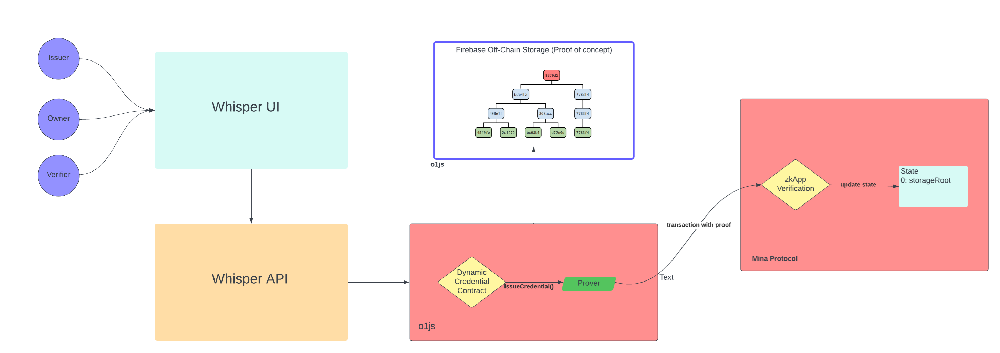

# Whisper Key


## Privacy enhanced Verifiable Credentials (VC) Hub

A platform where Verifiable Credential Issuers can create new types of credentials or reuse existing standards and issue them to owners with ease. Owners selectively disclose some or all the data in their Verifiable Credential with Verifiers via Zero Knowledge proofs while Verifiers obtain only the information needed.

## Architecture



Whisper Key consists of 3 major components: a front-end for visually designing and issuing credentials. An API that generates those credentials in the form of smart contract code and dynamic interaction code. It also provides access to data stored in off-chain storage. An NPM package containing a pipeline for dynamically generating smart contracts, proxy code to dynamically invoke smart contract code and a simple off-chain storage library.

### Whisper UI

The Whisper UI application is the hub of the Whisper Key ecosystem, it allows end users to design credentials capturing the data they need and issue them directly to their customers. Whisper UI generates a form dynamically based on the design of the credential. This allows Issuers to initiate transactions to any type of credential without having to write code. 

#### Features

* Login with Auro Wallet
* Create a new type of credential
* Issue a credential type to Owner
* View created credential types
* View your "Owned" credentials

#### Technology

* NodeJS
* NextJS
* ReactJS
* o1js

#### How to run

Set the following environment variable to point the the api. for example

`NEXT_PUBLIC_CREDENTIALS_API=http://localhost:3001/api/credentials`

Navigate to the ui folder and run the following commands

`npm install && npm run build`

`npm run start` 

### Whisper API

The Whisper API is the workhorse of the Whisper Key ecosystem. 

### Features can include

- As an Issuer based on user input automatically generate the definition of a credential and the supporting smart contract to create its proof
- Search for existing credential types
- As an Issuer issue a Verifiable Credential to an Owner
- As an Owner store your Verifiable Credential securely
- As an Owner choose what data you are willing to share with which Verifier
- As a Verifier prove an Owner meets criteria outlined in a smart contract
- An API that allows integration of third-party systems acting as any or all actors Issuers, Owners and Verifiers

### API

The API generates verifiable credentials, saves the credentials to a database and deploys the credentials

#### How to run

- navigate to api folder
#### Commands
- ```npm install```
- ```npm run build```
- ```npm run start```

Invoke API using Postman or the like
- URL will look like: http://localhost:3000/api/credentials
  - Note: The port for the url can be found in the `app.ts` file of the `src` folder of the `api` project

#### Sample json

`{ "name": "License", "fields":[ { "name": "number", "type": "CircuitString"}, { "name": "name", "type": "CircuitString"} ] }`
